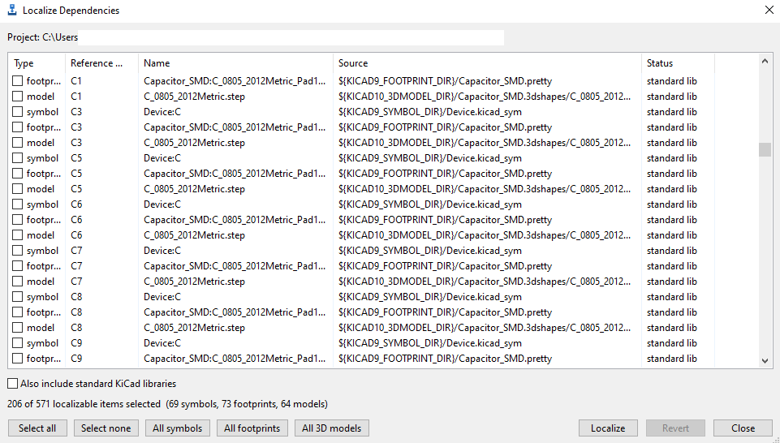
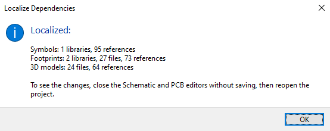

# Localize Dependencies

A KiCad 10 action plugin that makes a project self-contained. It copies the
external symbols, footprints, and 3D models a project uses into project-local
libraries and updates every reference to point at them. After that the
schematic, board, 3D view, and STEP export still work on any machine, even if
the original global or third-party libraries aren't installed.

You pick what to localize (symbols, footprints, 3D models, or any mix), run it,
and reload the project. Every run is backed up first, so you can revert.

## What makes it different

- Symbols, footprints, and 3D models, not only one of the three.
- It uses the IPC API, so it runs on KiCad 10 and will keep running on KiCad 11,
  where the old SWIG bindings are gone. SWIG-based plugins stop working there.
- Revert is exact. Each file is backed up before it's touched, and revert copies
  those backups straight back, so the project returns to precisely how it was.
- You can localize just the parts you want.
- Tick "include standard KiCad libraries" and it also pulls in the stock libs,
  which cuts the project loose from the global libraries completely.

## Why

KiCad only stores references to library symbols, footprints, and 3D models, not
the items themselves. Move the project to another PC, or send it to a colleague
or a fab house, and anything that lived in a global or third-party library breaks.
The 3D models go missing, footprints stop resolving, symbols get rescued. This
plugin pulls those items into the project so that stops happening.

## How it works

The plugin talks to KiCad over the IPC API (`kicad-python` / `kipy`) just long
enough to find the open project, so the removal of the SWIG bindings in KiCad 11
doesn't affect it. The editing happens on the project files directly, with a
small S-expression parser that only rewrites the references it needs to and
leaves the rest of each file byte-for-byte alone. Tokens it doesn't recognise
(something new in a future KiCad version, say) pass through unchanged.

Before it changes a file it copies the original into `.portability/`. Revert
reads that back and deletes anything the run created.

## Requirements

- KiCad 10.0 or newer, with the IPC API server enabled under
  *Preferences > Plugins*.
- `kicad-python` and `wxPython`, which KiCad installs for you on first run.

## Install

### From the Plugin and Content Manager

*Tools > Plugin and Content Manager > Plugins*, find Localize Dependencies,
install it, and restart the PCB editor. (Pending acceptance into the official
repository.)

### Manually

1. Download the latest `localize-dependencies-x.y.z.zip` from the
   [Releases](https://github.com/jOaSbA/localize-dependencies/releases) page.
2. *Tools > Plugin and Content Manager > Install from File...* and pick the zip.
   You can also just unzip the `plugins/` contents into
   `Documents/KiCad/10.0/plugins/localize_dependencies/`.
3. Enable the IPC API server, then *Tools > External Plugins > Refresh Plugins*.

## Use

1. Save the project first (`Ctrl+S`).
2. Run Localize Dependencies and tick the items you want. By default it checks
   only the external and third-party dependencies. Tick "Also include standard
   KiCad libraries" if you want it fully independent of the global libraries.
3. Click Localize. External symbols and footprints land in `libs/<name>_local.*`,
   3D models in `packages3D/`, the `sym-lib-table` and `fp-lib-table` get the new
   entries, and the references are updated.
4. Reload the project so KiCad reads the new files: close the Schematic Editor
   and PCB Editor **without saving**, then reopen the project (double-click the
   schematic/board in the project manager, or use File > Open Recent). KiCad has
   no single "reload" command, so this close-and-reopen is the way. Don't save
   from KiCad before reopening, or you'll write the old paths back over the new
   files.
5. To undo, run the plugin again and hit Revert.

## Safety

Nothing changes until you click Localize, and whatever it changes is copied into
`.portability/` first. Revert puts every modified file back as it was and removes
the local copies. Since it works on files on disk, get in the habit of saving
before you run it and reloading after, and keep important projects under version
control.

## Building the package

Run `python build.py`. It produces `dist/localize-dependencies-<version>.zip` in
the layout the Plugin and Content Manager wants and writes the archive's SHA-256
and sizes into `metadata.json`.

## License

[GPL-3.0-or-later](LICENSE).
